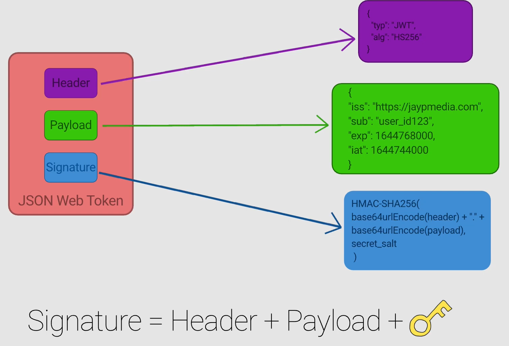
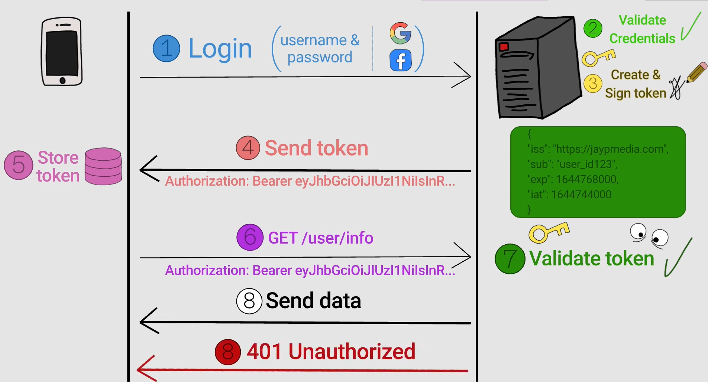

# JWT

Advantages:
- Ligthweight
- It can be used in mulitple platforms like web, mobile, desktop and etc
- Json. Easy to parse
- Stateless. Server doesn't need to store user data (state) on server 

Disadvantages:
- Manually mark non-expired JWT as invalid on logout
- Should not store sensitive info since it is stored on client-side
- On client-side, it should be stored in a safe place.